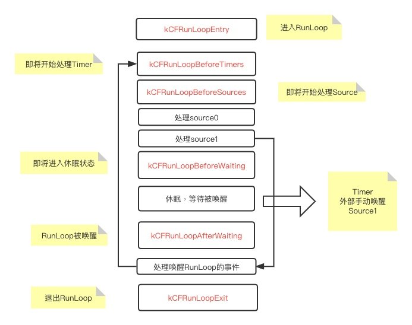

# 面试题

## RunLoop

### 1. 什么是RunLoop

RunLoop是一个通过内部事件循环来管理消息/事件的对象，它通过内核态和用户态的切换来实现
* 没有消息需要处理时进行休眠以避免资源占用
* 有消息需要处理时唤醒以处理消息


### 2. RunLoop与线程的关系

RunLoop与线程是一一对应的，主线程的RunLoop自动创建，子线程的RunLoop需要手动创建。RunLoop在对应的现场销毁时销毁。

### 3.RunLoop生命周期



### 4. RunLoop实际的应用场景

1. 线程保活(常驻线程的实现)
```
代码：

```

2. 避免在UI操作的时候刷新界面
```
self.perform(#selector(next), with: nil, afterDelay: 0.0, inModes: [RunLoop.Mode.default])
```
RunLoop具有不同的Mode, 当RunLoop在一种模式下运行时，不会处理其他mode下的timer, source和observer.
系统有以下几个Mode,而实际上公开的只有kCFRunLoopDefaultMode和UITrackingRunLoopMode.
```
kCFRunLoopDefaultMode: App的默认 Mode，通常主线程是在这个 Mode 下运行的。
UITrackingRunLoopMode: 界面跟踪 Mode，用于 ScrollView 追踪触摸滑动，保证界面滑动时不受其他 Mode 影响。
UIInitializationRunLoopMode: 在刚启动 App 时第进入的第一个 Mode，启动完成后就不再使用。
GSEventReceiveRunLoopMode:接受系统事件的内部 Mode，通常用不到。
kCFRunLoopCommonModes:占位用的mode,不是一个真正的mode,代表着UITrackingRunLoopMode+kCFRunLoopDefaultMode
```

3. 监听RunLoop状态，在空闲的时候进行一些低优先级的操作
```
CFRunLoopObserverRef observer = CFRunLoopObserverCreateWithHandler(CFAllocatorGetDefault(), kCFRunLoopAllActivities, YES, 0, ^(CFRunLoopObserverRef observer, CFRunLoopActivity activity) {
        switch (activity) {
            case kCFRunLoopEntry:
                NSLog(@"即将进入runloop");
                break;
            case kCFRunLoopBeforeTimers:
                NSLog(@"即将处理 Timer");
                break;
            case kCFRunLoopBeforeSources:
                NSLog(@"即将处理 Sources");
                break;
            case kCFRunLoopBeforeWaiting:
                NSLog(@"即将进入休眠");
                break;
            case kCFRunLoopAfterWaiting:
                NSLog(@"从休眠中唤醒loop");
                break;
            case kCFRunLoopExit:
                NSLog(@"即将退出runloop");
                break;
            default:
                break;
        }
    });
        CFRunLoopAddObserver(CFRunLoopGetCurrent(),observer,kCFRunLoopDefaultMode);
```

## 自动释放池

1. 自动释放池什么时候释放
//第一次创建：启动runloop的时候
//最后一次销毁： runloop退出的时候
//其他时候的创建和销毁: 当runloop即将睡眠时销毁之前的释放池，重新创建一个新的
2. 自动释放池的应用场景

## 关键字


1. @property有哪些属性关键字 
>原子性 —— nonatomic, atomic
读/写权限 —— readwrite, readonly
内存管理语义 —— strong, weak, copy, assign, unsafe_unretained 
方法名 —— getter=<name>, setter=<name>

1. 什么情况下使用weak关键字，和assign的区别是什么

2. 怎么用copy关键字

3. @property(copy) NSMutableArray *array;写法有什么问题

4. 如何让自己的类用copy修饰符？ 即让自己写的对象具备拷贝功能？

5. @property的本质是什么？ ivar, getter. setter如何生成并添加的这个类中的
6. automic的作用，与及注意事项 
7. 

## 多线程